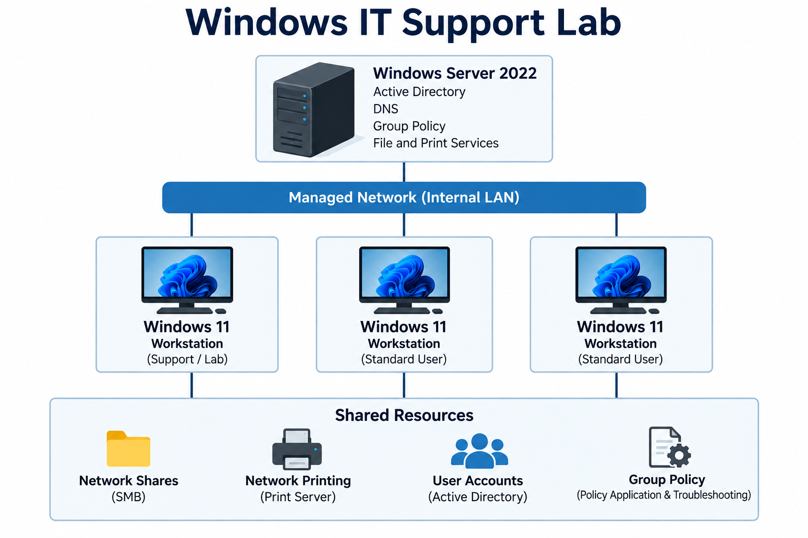

# Windows IT Support Lab

**PJ Cybulski | CompTIA A+ Certified**

Hands-on portfolio documenting my practical Windows IT support training
and troubleshooting work in a simulated organizational environment.

I created this lab to develop and reinforce the support skills used in
managed Windows environments. My focus is on diagnosing user and
workstation problems, understanding the evidence before making changes,
verifying the resolution, documenting the work performed, and
recognizing when an issue should be escalated.

This portfolio complements my professional experience providing
technical support for users, software, computers, peripherals, networked
AV systems, and collaboration technology.
## Purpose

This lab was created to build and reinforce practical IT support skills through realistic support scenarios rather than infrastructure design for its own sake.

The focus is on supporting users and Windows workstations inside an existing managed environment, including:

- Windows 11 endpoint troubleshooting
- Active Directory user and computer support
- Password resets, account status, and group membership
- Group Policy troubleshooting from domain-joined clients
- Shared folders, drive mappings, access, and permissions
- Network printing and print-related troubleshooting
- TCP/IP, DNS, DHCP, and connectivity troubleshooting
- Windows services, startup, applications, drivers, and peripherals
- Ticket documentation, verification, and appropriate escalation

## Lab Topology

The lab uses a Windows Server domain environment with multiple
domain-joined Windows 11 workstations and shared organizational
resources. The diagram below shows the simplified environment used
for support and troubleshooting exercises.

## Lab Environment

The environment includes:

- Windows Server 2022 domain controller
- Active Directory Domain Services
- DNS
- Windows 11 Pro domain-joined workstations
- Technician and standard-user accounts
- Role-based security groups and permissions
- Group Policy
- Shared network resources
- Windows print services
- Physical network printer
- Virtualized lab infrastructure

The lab is intentionally presented here as a generic organizational environment and is not intended to represent the internal systems or architecture of any real organization.

## Core Skills Demonstrated

- Windows 11 endpoint troubleshooting and support
- Active Directory user and computer support
- Password resets, account status, and group membership
- Group Policy application and client-side troubleshooting
- DNS, DHCP, TCP/IP, and network connectivity troubleshooting
- SMB network shares, mapped drives, and permissions
- Windows print services and network printing
- Windows services, Device Manager, and endpoint configuration
- Diagnostic tools including `ipconfig`, `ping`, `nslookup`,
  `gpresult`, and `Test-NetConnection`
- Troubleshooting documentation, verification, and escalation

## Training Method

Support incidents are introduced into the lab as controlled troubleshooting scenarios.

During an exercise, the reported symptom is presented without revealing the underlying cause. I then work through the issue using normal support and diagnostic methods, document the evidence gathered, determine and implement an appropriate resolution when possible, verify functionality, and escalate when the issue falls outside the technician role or requires additional investigation.

AI tools are used to assist with lab infrastructure, scenario preparation, and documentation. Troubleshooting decisions, diagnostic steps, resolutions, verification, and escalation decisions documented in this portfolio reflect my own work during the exercises.

## Selected Support Incidents

### [Domain Resources Unavailable While Internet Remained Functional](incidents/dns-domain-resource-access.md)

Diagnosed a domain-joined Windows 11 workstation that retained internet
connectivity while losing access to mapped organizational resources.
Isolated the problem to incorrect client DNS configuration, corrected
the configuration, and verified restored resource access.

**Skills:** Windows 11 · DNS · Domain Resources · Mapped Drives ·
Network Troubleshooting · Verification

### [Workstation Lost Network Connectivity](incidents/disabled-network-adapter.md)

Troubleshot a Windows 11 workstation that lost internet access and
organizational network connectivity while other users remained
unaffected. Isolated the issue to the local workstation, identified a
disabled Ethernet adapter in Device Manager, restored the adapter, and
verified connectivity.

**Skills:** Windows 11 · Device Manager · Network Adapters ·
TCP/IP · Scope Isolation · Verification

### [Network Shares Unavailable Despite Normal Network Connectivity](incidents/smb-connectivity-firewall.md)

Investigated a Windows 11 workstation where internet connectivity, DNS,
and basic server communication remained functional while SMB network
shares were inaccessible. Isolated the failure to TCP port 445,
identified a local firewall rule blocking the service, restored
connectivity, and documented the unexplained configuration for
escalation.

**Skills:** Windows 11 · SMB · TCP/445 · Test-NetConnection ·
Windows Defender Firewall · Troubleshooting · Escalation

Additional support incidents will be added as training continues.

## Portfolio Status

This portfolio is an active record of ongoing hands-on Windows IT support training. Additional incidents will be added as they are completed and reviewed.
